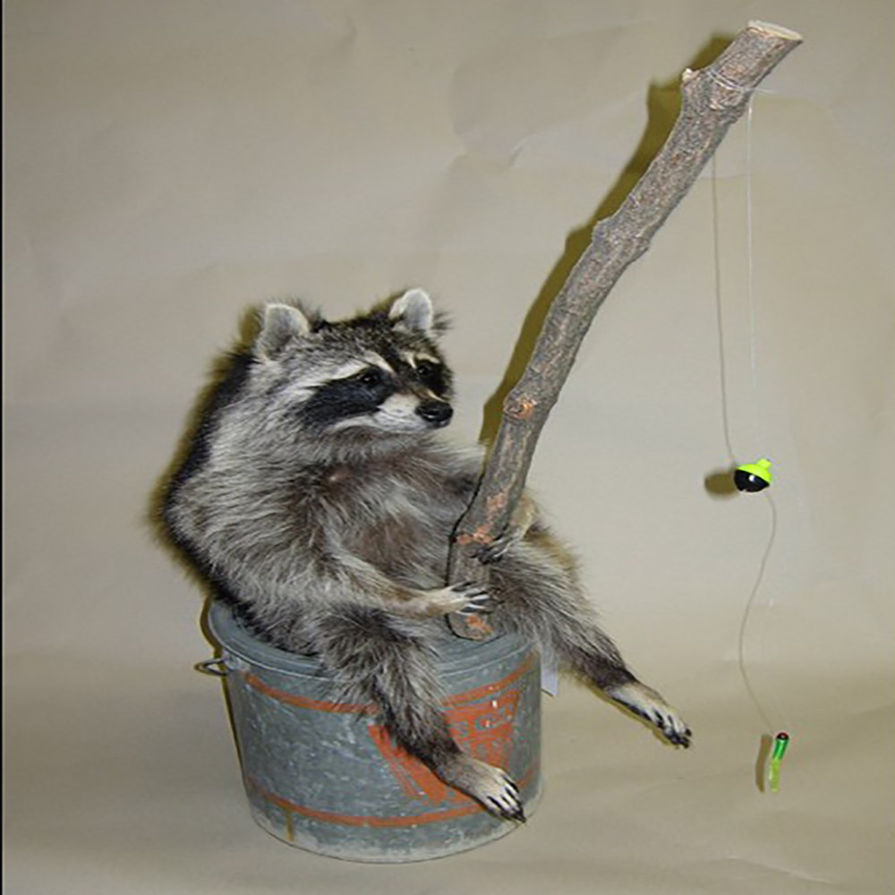

# Scrapfishin'

<a href="https://shoptherefuge.com/product/fishing-raccoon-minnow-bucket/">" width="250" /></a>

### Meet Scrap!

Scrap doesn't have a job, but he still needs to eat! Have no fear raccoons are
naturally curious and great problem solvers. They're also great bandits, and
Scrap is no different! Who needs a mealkit when you have Scrap here to help
guide you through all the same recipes!

Photo credit: Louie Leep, "[Fishing Racoon on a Minnow Bucket][1]" @ The Refuge

---

### API example
###### *api under construction, example shows future  end-user usage

```python
from scrapfishin import Scrap


scrap = Scrap()

# scrapes <site> and stores Recipe data into a local SQLite database
scrap.fish(site='Hello Fresh')

# extract Recipe data from our database
recipes = scrap.prepare(cuisine='italian', n=3)

print(recipes[1].title)
"""
Creamy Parmesan Chicken Spaghetti with Roasted Tomatoes and Basil
"""

groceries = scrap.collect(recipes)
print('\n'.join([f'{item.amount} of {item.food}' for item in groceries]))
"""
 9.0 ounce of cheese tortelloni
10.0 ounce of chicken breast strips
 3.0 unit of chicken stock concentrate
 1.0 teaspoon of chili flakes
 4.0 tablespoon of cream cheese
 2.0 box of crushed tomatoes
 1.0 teaspoon of dried oregano
 2.0 clove of garlic
 2.0 teaspoon of garlic powder
 8.8 ounce of gnocchi
 0.5 cup of italian cheese blend
 9.0 ounce of italian pork sausage
 1.0 unit of lemon
14.0 ounce of marinara sauce
 0.5 cup of mozzarella cheese
 0.5 cup of panko breadcrumbs
 0.5 cup of parmesan cheese
0.25 ounce of parsley
 6.0 ounce of penne
 2.0 unit of roma tomato
 5.0 ounce of spinach
 9.0 ounce of sweet italian pork sausage
 2.0 tablespoon of tuscan heat spice
 1.0 unit of yellow onion
 1.0 unit of zucchini
"""
```

[1]: https://shoptherefuge.com/product/fishing-raccoon-minnow-bucket/